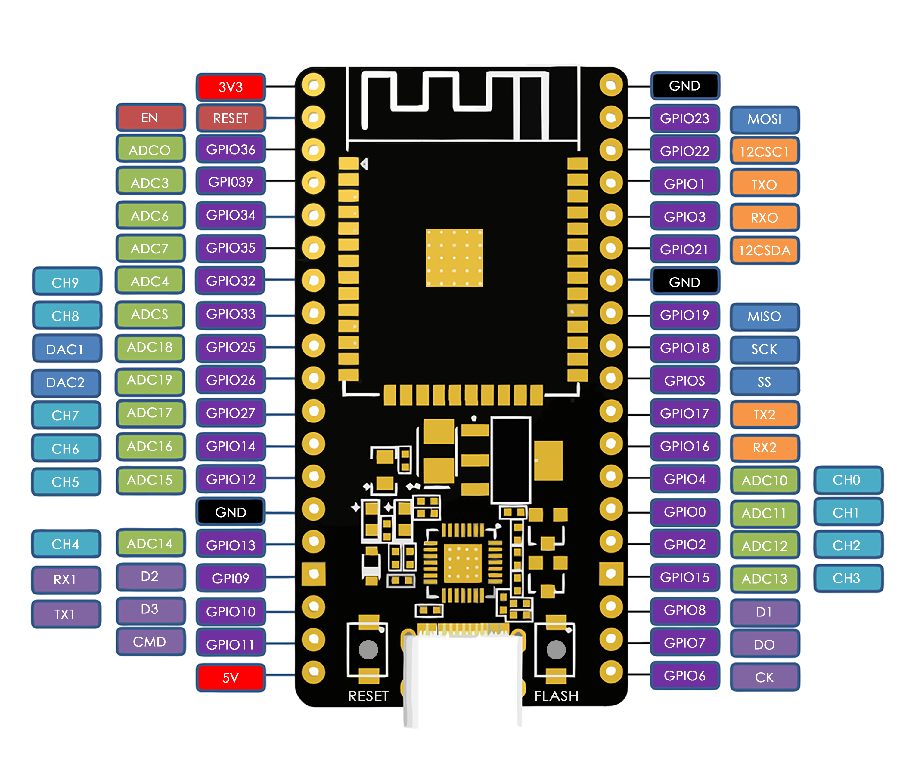
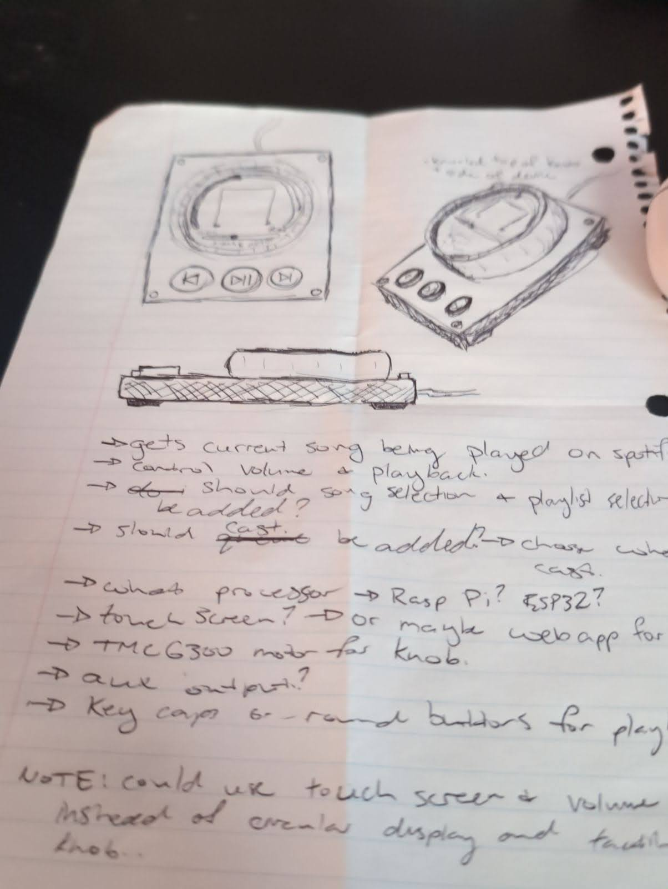

# PlaybackPilot

A device that controls the playback of Spotify using an ESP32 development board

# SETTING UP ESP32 BOARD

## Arduino IDE

- add to File > Preferences -> Additional boards manager URLs: https://dl.espressif.com/dl/package_esp32_index.json
- Boards Manager -> search ESP32 -> install esp32 by Espressif Systems
- select NodeMCU-32S board (may change depending on board) - select correct COM port
  - NOTE: if device is not recognized on ports download the [drivers](https://www.silabs.com/developers/usb-to-uart-bridge-vcp-drivers?tab=downloads)
- add 'SimpleFOC' from library manager. (SimpleFOC by Simplefoc)
- add 'ArduinoJson' from library manager. (ArduinoJson by Benoit Blanchon)
- add 'TFT_eSPI' from library manager. (TFT_eSPI by Bodmer)
- upload hold down 'FLASH' button and click upload (see ESP-WROOM-32 for more info)

## ESP-WROOM-32

- info for specific board used - https://iotcrazy.com/esp-wroom-32
  

## CONNECTING TO WIFI

- to connect to wifi open the code and input your WiFi network name (SSID) and password in the 'settings.h' file

## CONNECTING GC9A01

The display used is a GC9A01
the following ports are where each pin is connected:

- GND -> GND
- VIN -> 3v3
- SCL -> GPIO18 SPI clock (SCL)
- SDA -> GPIO23 (MOSI) SPI data (SDA)
- RES -> GPIO4 Reset (can be any free GPIO but must be modified in DisplayUtils.cpp)
- DC -> GPIO2 Data/command (can be any free GPIO but must be modified in DisplayUtils.cpp)
- CS -> GPIO15 Chip select (can be any free GPIO but must be modified in DisplayUtils.cpp)
- BLK -> 3v3 (can be connected to pin out if you want to control back light)

### TFT_eSPI GC9A01

- to connect the board it requires some setup.
  - go to the library source folder and choose libraries > TFT_eSPI and open 'User_Setup_Select.h'.
  - comment out '#include <User_Setup.h>'
  - uncomment your display. in this case '#include <User_Setups/Setup46_GC9A01_ESP32.h>'

## SPOTIFY

- go to [this](https://developer.spotify.com/documentation/web-api) web page for learning how to get clientId and clientSecret. once figured out input those fields into the variables in 'settings.h'
- the refresh token is gathered through gathering an authentication and copying and pasting it

## AS5048A Reading Encoder

- install SimpleFOC by Simplefoc from library manager
- connect to GND and 3v3. connect PWM to GPIO32

# TODO/Design

- [x] connect esp32 to wifi (done)
- [x] get get post update delete methods
- [x] create class, check auth tokens (bearer)
- [x] create Spotify class
- [x] connect (initializes connection with Spotify API)
- [x] get currently playing
- [x] play
- [x] pause
- [x] volume
- [x] refresh auth tokens
- [ ] async api calls
- [ ] connect buttons to said Spotify methods
- [x] connect magnetic encoder to control the above methods
- [ ] add gimbal motor haptic feedback to receive audio differences
- [ ] add ability to connect board to WiFi without uploading code every time (probably requires seperate API calls) -[possible youtube solution](https://www.youtube.com/watch?v=JYtDibqJMs0&ab_channel=techiesms)
- [ ] add ability to connect Spotify account without uploading code every time (probably requires seperate API calls)
- [ ] figure out how to create a webhook to connect to Spotify playback (not possible with current Spotify documentation?)
- [ ] design UI to display the info (playback etc)
- [ ] find way to display image on ui
- [ ] connect display to esp32 -> display UI on esp32 [setting up display](https://dronebotworkshop.com/gc9a01/)

- possible Todo
  -> aux?
  -> cast control
